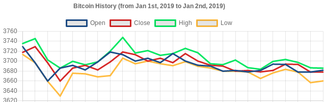

# cryptic
Cryptic is a cryptocurrency data API and dashboard for [cryptodatadownload](https://www.cryptodatadownload.com/) using GraphQL, React and Chart.js. It supports different cryptocurrencies and exchanges.

## Data format
The default data format follows [cryptodatadownload's .csv files](https://www.cryptodatadownload.com/data/), with `date` (Timestamp UTC timezone), `symbol`, `open`, `high`, `low`, `close`, `volume of cryptocurrency` (e.g. BTC) and `volume of a physical currency` (e.g. USD). However, any data following this format should work.

## Importing data to database
First, set up your database. At this time, it only supports MongoDB but it's not hard to add another one, like PostgreSQL with sequelize. `api/src/db/index.js` has the configuration you may want to check.

After that, you need to download a exchange and cryptocurrency csv file from
[cryptodatadownload](https://www.cryptodatadownload.com/data/) or use your own (csv file should not have any header).
Then run `node api/src/cmd/populateCurrencies.js <csv file>`. Tip: You can use some kind of cron job to automatically fetch and store data in your db.

## Running the API
The API uses GraphQL to query db. To get the server running just run `npm run api`.

## Front-end
Web front-end is using React and Chart.js to rendering. To start the development server run `npm run web`.